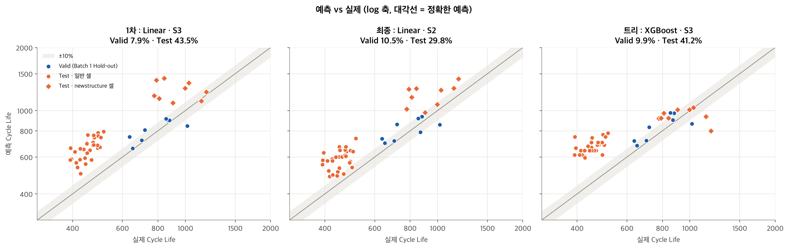
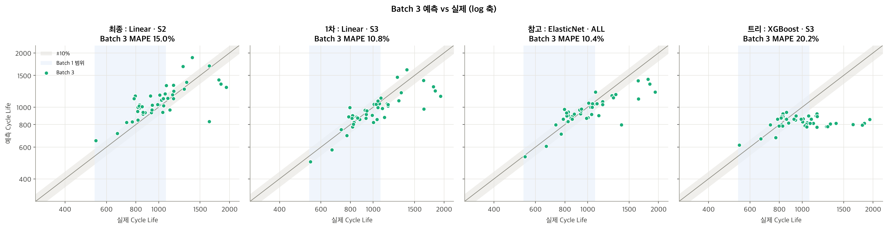
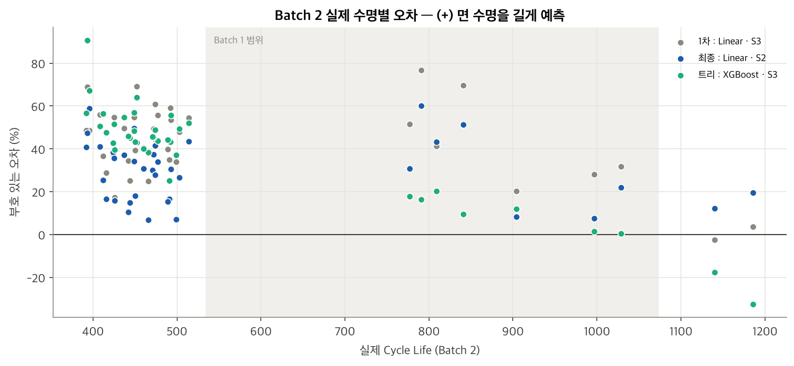

# ESS 배터리 수명 예측

ESS 배터리의 교체 비용은 CAPEX 의 30 ~ 40% 를 차지한다. 이 프로젝트는 **초기 100 사이클의 측정 데이터만으로 배터리의 전체 수명을 예측**하여, 교체 시점을 사전에 계획할 수 있는 근거를 만드는 것을 목표로 한다.

**결과 요약**
- 최종 모델 : Linear Regression (`dq_var`, `dq_lowv_mean`) — 배치가 바뀌어도 수명과의 관계가 유지되는 ΔQ(V) 피처만 사용
- 성능 (MAPE) : Valid (Batch 1) 10.48% / Test (Batch 2) 29.76% / 추가 검증 (Batch 3) 14.95%
- Test 오차의 대부분은 Batch 2 전체를 약 1.29배 길게 예측하는 **배치 offset** → offset 을 빼면 9.43% (Target 9.1%), 셀 간 수명 순서는 유지 (Spearman 0.74)
- 새 배치에서 기준 셀 3 ~ 5개로 보정하면 약 10 ~ 11% → 실제 운영에서는 배치별 보정이 필요하다는 결론


## 프로젝트 개요
- 데이터셋 : MIT-Stanford Battery Dataset (Severson et al., Nature Energy 2019)
  - 같은 제품의 LFP/흑연 셀(공칭 용량 1.1Ah)을 **충전 방식만 셀마다 다르게** 해서, 수명이 다할 때까지 충·방전을 반복한 실험 데이터
  - **Batch** : 같은 시기에 함께 시험한 셀 묶음. 시험 시기와 실험 조건이 조금씩 달라 배치마다 수명 분포가 다르다

| Batch | 시험 시작일 | 사용 셀 | 수명 (사이클) | 특징 | 용도 |
|---|---|---|---|---|---|
| Batch 1 | 2017-05-12 | 36 | 534 ~ 1074 | 충전 정책 20개로 다양 (0→80% 충전 8.9 ~ 12분) | EDA, **학습** |
| Batch 2 | 2018-02-20 | 39 | 392 ~ 1186 | 대부분 짧은 수명, 모든 정책이 10분 충전 | EDA, **평가 (Test)** |
| Batch 3 | 2018-04-12 | 44 | 541 ~ 1935 | 긴 수명이 많음, 모든 정책이 10분 충전 | EDA, 추가 검증 |

- 태스크 : **Regression** — `cycle_life` (방전 용량이 초기의 80%, 0.88Ah 에 도달할 때까지의 사이클 수) 예측
- 평가 지표 : MAPE (원논문 Target 9.1%)


## 파일 구조
```
├── data/
│   └── README.md               # 데이터 다운로드 및 전처리 방법
├── notebooks/
│   ├── 01_EDA.ipynb            # EDA 및 모델 설계 전략
│   ├── 02_modeling.ipynb       # 모델 개발, 성능 평가, 오류 분석
│   └── 03_batch3_validation.ipynb  # Batch 3 추가 검증
├── src/
│   ├── preprocess.py           # .mat 원본 → 분석용 캐시 (data/processed/)
│   ├── features.py             # 센서 이상값 정제, ΔQ(V) 및 셀 단위 피처 계산
│   ├── train.py                # 데이터 분할, 모델 학습 · 비교, 성능 리포팅
│   └── viz.py                  # 그래프 공통 스타일
├── results/
│   ├── figures/                # EDA · 모델링 그래프
│   ├── model_comparison.csv    # 모델 × 피처 세트별 Train CV / Valid / Test MAPE
│   ├── model_performance.csv   # 최종 모델 성능 (Reporting format)
│   └── model_performance_batch3.csv  # Batch 3 추가 검증 포함 성능
├── requirements.txt
└── README.md
```


## 환경 설정
- Python 3.11, 패키지 버전은 `requirements.txt` 에 고정 (numpy 2.4.6, pandas 3.0.6, scikit-learn 1.9.1, xgboost 3.2.0 등)
- 모델 학습의 무작위성은 `random_state=42` 로 고정 → 같은 환경에서 실행하면 같은 성능표가 나온다

```bash
git clone https://github.com/apej460/ess-battery-project.git
cd ess-battery-project

python3.11 -m venv .venv
source .venv/bin/activate
pip install -r requirements.txt

# 원본 데이터를 data/ 에 받은 뒤 (data/README.md 참고)
python -m src.preprocess     # 전처리 캐시 생성
python -m src.train          # 모델 비교 및 최종 성능표 생성 → results/
```


## EDA

`notebooks/01_EDA.ipynb`

### 데이터 정제
- Batch 1 의 10개 셀은 EOL(0.88Ah)에 도달하기 전에 실험이 종료되어 실제 수명을 알 수 없음 → 제외
- Batch 2 의 VarCharge / SLOWCYCLE 실험 셀 8개, Batch 3 의 수명 미도달 셀 2개 → 제외
- 최종 사용 셀 : Batch 1 **36개**, Batch 2 **39개**, Batch 3 **44개**
- 센서 오류값(QD 2.88Ah, 충전 시간 3,934분 등)은 정상 범위 밖이면 NaN 처리 후 셀 내부 보간

### Cycle Life 분포
- 배치마다 분포가 크게 다르다. 중앙값 Batch 1 **772** / Batch 2 **472** / Batch 3 **1006**
- Batch 2 는 두 개의 군집 : 일반 셀 30개(392 ~ 514)와 `newstructure` 셀 9개(777 ~ 1186)
- 배치별로 유독 짧은 셀은 모두 5C 이상의 높은 전류로 넓은 충전 구간을 충전하는 정책 (`5.4C(80%)-5.4C`, `3.6C(9%)-5C`, `3.7C(31%)-5.9C` 등)
- 핵심 발견 : **Batch 2 의 77% 가 학습 데이터(Batch 1)의 최소 수명 534 보다 짧다** → 학습 범위 밖을 예측해야 하는 외삽 문제


### 열화 곡선 분석
- 모든 배치에서 완만한 감소 → 급격한 감소의 비선형 열화. 초기 100 사이클의 열화 속도는 사실상 0, EOL 직전은 0.9 ~ 1.8 mAh/cycle
- Knee point 는 수명의 **70 ~ 76%** 지점에서 발생하며, 모든 셀에서 cycle 243 이후
- 핵심 발견 : 예측 시점(cycle 100)에는 모든 셀의 용량이 아직 거의 그대로 → **방전 용량 총량만으로는 장·단수명 구분이 어렵다**

### ΔQ(V) 곡선 분석
- ΔQ₁₀₀₋₁₀(V) = cycle 100 과 cycle 10 의 전압별 방전 용량 차이. 3.0V 부근에서 가장 크게 패인다
- 단수명 셀일수록 곡선이 더 깊고 넓게 패이며, 세 배치 모두 장·단수명 셀의 평균 곡선이 뚜렷하게 구분된다
- 핵심 발견 : **log Var(ΔQ) 와 log(cycle_life) 의 상관 r = −0.84 (B1) / −0.92 (B2) / −0.76 (B3)** — 용량 총량이 변하지 않은 시점에도 ΔQ(V) 는 수명 차이를 담고 있다


### 충전 속도(C-rate)와 수명의 관계
- Batch 1 은 0→80% 충전 시간이 8.9 ~ 12.0분으로 다양하고, 느리게 충전할수록 수명이 길다 (r = 0.59)
- Batch 2·3 은 모든 정책이 **10분 충전**으로 동일 → 충전 시간과 수명의 상관이 배치마다 뒤집힌다 (+0.59 / −0.35 / +0.02)
- 열화 속도(사이클당 평균 용량 감소)도 Batch 1 에서만 충전 시간과 상관이 있다 (r = −0.65, Batch 2·3 은 −0.01 ~ +0.28)
- Batch 2 에서는 같은 정책이라도 `newstructure` 셀의 수명이 약 2배. newstructure 셀은 사이클 안의 휴지 시간이 약 0.3분, 일반 셀은 약 21분
- 핵심 발견 : 충전 정책 변수는 **Batch 1 안에서만 유효한 신호** → Batch 2 로 일반화되지 않는다

### 상관관계
- 초기 100 사이클 기반 후보 피처 23개를 배치별로 비교
- 세 배치에서 부호가 같고 강한 피처는 **ΔQ 계열(`dq_var`, `dq_min`, `dq_mean`)뿐**. 충전 시간, 용량 기울기, IR, 온도는 배치에 따라 부호가 뒤집힌다
- ΔQ 피처끼리 공선성이 매우 높다 (VIF 72 ~ 415)


## Modeling

### 피처 엔지니어링 전략
"Batch 1 에서 상관이 높은 피처" 가 아니라 **"배치가 바뀌어도 관계가 유지되는 피처"** 를 기준으로 선택한다.

| 구분 | 피처 | 근거 |
|---|---|---|
| 핵심 | `dq_var` | 세 배치 모두 상관 절댓값 0.76 이상, log-선형 관계 |
| 보조 후보 | `dq_min`, `dq_mean` | 같은 방향으로 강함. 공선성이 높아 규제와 함께 사용 |
| 보조 후보 | `dq_lowv_mean` (파생) | 2.0 ~ 2.7V 구간 ΔQ 평균. 세 배치에서 일관되고 `dq_var` 와 겹침이 낮음 |
| 보조 후보 | `fade_slope_91_100`, `qd_2` | 부호 일관 또는 배치 간 차이 보정 가능성 — Valid 성능으로 검증 |
| 제외 | `C1`, `Q1`, `C2`, `t80_policy`, `chargetime_2_6` | Batch 2 에서 값이 거의 상수, 배치마다 부호 반전 |
| 제외 | IR 계열 | 배치마다 부호 반전, Batch 2 에 측정 결측 셀 6개 |
| 제외 | `dq_area_29_31`, `dq_var_50_10`, `dq_v_at_min` (파생) | 배치에 따라 약해지거나 신호 없음. 50 사이클 ΔQ 는 신호 부족 → 예측 시점 100 사이클 유지 |

### 모델 선택 및 근거
- 타깃 : `log10(cycle_life)` — 오른쪽 꼬리가 긴 분포, 상대 오차(MAPE) 평가
- 데이터 분할 : Batch 1 내 **충전 정책 단위** Hold-out / GroupKFold → 같은 정책 셀이 train·valid 에 나뉘는 누수 방지
- 후보 모델 :
  - Linear (`dq_var` 1개) — baseline
  - **ElasticNet / Ridge** — 소표본(36셀) + ΔQ 피처 공선성
  - Random Forest / XGBoost — 비선형성 비교용. 학습 범위 밖 외삽이 불가능해 Batch 2 단수명 셀에서 성능 하락 예상
- 모델 선택 기준 : Valid (Batch 1 Hold-out) MAPE. Test 점수로 모델을 고르지 않음

`notebooks/02_modeling.ipynb`

| 단계 | 내용 | 선택 모델 | Valid | Test |
|---|---|---|---|---|
| 1차 | EDA 기반 설계 전략의 S1 ~ S3 × 5개 모델 | Linear · S3 | 7.93% | 43.46% |
| 원인 분석 | Batch 2 정답 없이 피처 분포 확인 → `qd_2` 가 Batch 1 대비 표준편차 1.88배 이동, 54% 가 학습 범위 밖. 트리 모델은 Batch 1 최소 수명(534) 아래로 예측 불가 | | | |
| 2차 (최종) | 배치 간 관계가 일관된 피처(S1, S2) × 선형 계열 모델 | **Linear · S2** | 10.48% | **29.76%** |

- **최종 모델 : Linear Regression, 피처 `dq_var`, `dq_lowv_mean`**
- 선택 이유 :
  - 1차 모델은 Batch 1 안에서 가장 좋았지만(Valid 7.9%), S3 에 넣은 `qd_2` 가 Batch 2 에서 학습 범위를 크게 벗어나고, EDA 에서 배치마다 관계가 달랐던 피처라 Batch 2 로 일반화되지 않는다고 판단
  - ΔQ 피처는 Batch 2 에서도 범위를 벗어나지만, 세 배치에서 수명과의 관계가 같은 방향으로 유지되어 범위 밖으로 연장해도 의미가 있다고 판단
  - 트리 모델은 학습 범위 밖을 예측하지 못해 Batch 2 단수명 셀(392 ~ 514)을 구조적으로 맞힐 수 없음
  - 위 근거로 좁힌 후보(S1, S2 × Linear / Ridge / ElasticNet) 안에서 Valid 가 가장 낮은 조합을 선택


## 성능 결과

| 구분 | MAPE (%) | 계산 | 비고 |
|---|---|---|---|
| Train (Batch 1 CV) | 8.79 | | |
| Valid (Batch 1 Hold-out) | 10.48 | | |
| Test (Batch 2) | 29.76 | | |
| Gap (Train-Valid) | +1.70 | Valid − Train | (+) : 과적합 의심 |
| Gap (Valid-Test) | +19.28 | Test − Valid | (+) : 배치간 일반화 저하 의심 |
| Gap (Target-Test) | +20.66 | Test − Target(9.1) | Target : 원논문 9.1% |

- MAPE 는 낮을수록 좋은 지표이므로, "(+) : 과적합 / 일반화 저하 의심" 의미에 맞도록 모든 Gap 을 "뒤 단계 − 앞 단계" 로 계산 → (+) 면 뒤 단계에서 성능이 나빠짐
- Train CV : Batch 1 학습 구간 28셀, GroupKFold(5, group = 충전 정책) / Valid : 정책 4개 · 8셀 Hold-out / Test : Batch 1 전체로 재학습 후 Batch 2 39셀

### Gap 해석 — 왜 이렇게 나왔나

| Gap | 의미 | 원인 (근거) |
|---|---|---|
| Train-Valid +1.70 | Batch 1 안에서의 과적합은 크지 않음 | 피처 2개짜리 선형 모델이라 과하게 맞출 여지가 작음. 남은 차이는 **Hold-out 구성** 때문 : Hold-out 정책은 같은 정책 안 수명 차이가 평균 19.0% 로 학습 정책(6.6%)보다 커서 예측이 더 어려움 (예 : `4.8C(80%)-4.8C` 두 셀 636 / 870). 오차가 가장 큰 1셀을 빼면 Valid 9.2% |
| Valid-Test +19.28 | 배치가 바뀌면서 크게 나빠짐 | ① Batch 2 의 77% 가 Batch 1 최소 수명보다 짧아 학습 범위 밖을 예측 ② Batch 2 전체를 평균 1.29배 길게 예측하는 **배치 offset**. offset 만 빼면 Test 9.4% 로 Valid(10.5%)보다도 낮음 → **Valid-Test Gap 은 거의 전부 배치 offset** ③ 셀 간 수명 순서는 유지 (Spearman 0.74) |
| Target-Test +20.66 | 원논문 Target 보다 크게 높음 | Valid-Test 와 같은 원인. 학습과 같은 조건의 성능(Valid 10.5%)과 offset 을 뺀 Test(9.4%)는 Target 9.1% 와 비슷한 수준 → 모델이 배울 수 있는 관계는 배웠고, 차이는 배치가 바뀌면서 생기는 offset |




### Batch 3 추가 검증

`notebooks/03_batch3_validation.ipynb` — 최종 모델을 바꾸지 않고 Batch 3 (44셀) 에 그대로 적용

| 구분 | MAPE (%) | 계산 | 비고 |
|---|---|---|---|
| Train (Batch 1 CV) | 8.79 | | |
| Valid (Batch 1 Hold-out) | 10.48 | | |
| Test (Batch 2) | 29.76 | | |
| Gap (Train-Valid) | +1.70 | Valid − Train | (+) : 과적합 의심 |
| Gap (Valid-Test) | +19.28 | Test − Valid | (+) : 배치간 일반화 저하 의심 |
| Gap (Target-Test) | +20.66 | Test − Target(9.1) | Target : 원논문 9.1% |
| Test (Batch 3) | 14.95 | | |
| Gap (Batch2-Batch3) | −14.81 | Batch 3 − Batch 2 | Test 성능 간 비교 |
| Gap (Target-Test) | +5.85 | Batch 3 − Target(9.1) | Batch 3 기준, 원논문 성능 비교 |

| Gap | 원인 (근거) |
|---|---|
| Batch2-Batch3 −14.81 | Batch 3 가 14.8%p 더 좋음. Batch 3 는 offset 이 1.06배로 Batch 2 (1.29배)보다 훨씬 작음. 피처가 Batch 2 에 과적합됐다면 Batch 3 에서 더 나빠졌을 것이므로 그 신호는 없음 |
| Target-Test (Batch 3) +5.85 | 남은 오차는 offset 이 아니라 **셀 개별 오차** (offset 을 빼도 12.0%) : 800 미만 짧은 셀을 +22.5% 길게 예측, 같은 정책 안에서도 수명이 크게 다른 셀(`b3c42` 1642 vs `b3c37` 1390)을 양쪽으로 틀림 |

- Batch 3 는 offset 이 1.06배로 거의 없음 → 같은 모델이라도 배치에 따라 offset 이 크게 달라짐
- Batch 1 최대 수명(1074)보다 긴 Batch 3 셀 16개를 최종 모델은 −1.6% 로 맞힘. 트리 모델(XGBoost)은 −37.4% 로 짧게 예측하고 순서 상관이 −0.01 → 트리 모델은 짧은 쪽(Batch 2) · 긴 쪽(Batch 3) 모두 학습 범위 밖을 예측하지 못함
- `qd_2` 가 들어간 1차 모델은 Batch 2 43.5% → Batch 3 10.8% 로 가장 크게 흔들림. `qd_2` 가 Batch 2 에서는 높은 쪽, Batch 3 에서는 낮은 쪽으로 이동 → 배치에 따라 결과가 크게 달라지는 피처라는 판단을 재확인
- 참고 : ElasticNet · ALL 은 Batch 2 · 3 모두에서 최종 모델보다 낮았음 (27.3% / 10.4%). 테스트셋을 보고 알게 된 결과라 최종 모델은 바꾸지 않았지만, 새로운 배치로 추가 검증해볼 만함




## 오류 분석

| 항목 | 최종 모델 |
|---|---|
| 평균 부호 오차 — 일반 셀 30개 / newstructure 셀 9개 | +30.2% / +28.3% |
| Batch 2 내 수명 순서 (Spearman) | 0.74 |
| 배치 offset (예측 / 실제) | 1.29배 |
| offset 제거 시 MAPE (진단값) | 9.43% |
| Batch 2 기준 셀 3개 / 5개로 보정 시 MAPE (참고값) | 10.89% / 10.30% |

- **모델이 가장 크게 틀린 셀의 공통점** : Batch 2 의 모든 셀을 비슷한 비율로 길게 예측. 오차가 가장 큰 셀은 newstructure 셀(`b2c9` 791 → 예측 1267)과 Batch 2 에서 가장 짧은 일반 셀(`b2c15` 396 → 629)
- **오차의 구성** : 셀 간 수명 순서는 맞히지만(0.74), 배치 전체가 약 1.29배 밀려 있음. 이 offset 하나만 빼면 9.4% 로 Target 과 비슷해짐 → 오차의 대부분은 개별 셀이 아니라 **배치 단위의 차이**
- **원인 가설** : Batch 2 안에서 휴지 시간이 약 21분인 일반 셀(+30.2%)과 약 0.3분인 newstructure 셀(+28.3%)이 비슷하게 밀림. 휴지 시간이 같은 Batch 3 는 offset 이 거의 없음(1.06배) → offset 은 휴지 시간보다 **Batch 2 배치 전체에 공통된 요인**(셀 생산 로트, 시험 시기 등)으로 추정. 이 정보는 데이터에 없어 직접 확인하지 못함
- **개선 방향** : 새 배치에서 기준 셀 3 ~ 5개의 실제 수명으로 offset 을 보정하면 약 10 ~ 11%. 근본적으로는 여러 배치 · 운영 조건이 섞인 학습 데이터와, 셀 로트 · 시험 조건 같은 배치 정보를 함께 기록하는 것이 필요
- 트리 모델은 offset 을 빼도 13.4% 로 남음 → 학습 범위 밖 예측이 불가능한 구조적 한계




## ESS 도메인 해석

**활용 가능한 의사결정**
- **교체 우선순위 · 셀 선별** : 실험 조건이 바뀌어도 셀 간 수명 순서는 유지(Spearman 0.74) → "어떤 셀이 먼저 수명이 다할지" 순위를 매겨 교체 순서를 정하거나, 수명이 비슷한 셀끼리 모듈 · 팩을 구성하는 데 활용 가능
- **같은 운영 조건 안에서의 수명 예측** : 학습과 같은 조건(Batch 1 Hold-out)에서는 초기 100 사이클만으로 약 10% 오차 → 교체 예산 · 일정을 미리 계획하는 근거로 활용 가능
- **새 운영 조건 도입 시** : 기준 셀 3 ~ 5개를 수명 끝까지 시험해 보정하면 약 10 ~ 11% → 전체 셀을 끝까지 시험하지 않고도 수명 예측 가능

**한계와 실 배포를 위해 필요한 것**
- **과대 예측 위험** : 운영 조건이 다르면 수명을 약 1.29배 길게 예측함. ESS 에서 수명을 길게 예측하면 교체가 늦어져 예기치 못한 설비 중단으로 이어질 수 있으므로, 보정 없이 절대값을 그대로 쓰면 안 됨
- **배치 · 운영 조건 데이터** : 같은 모델이라도 배치에 따라 offset 이 1.29배(Batch 2) ~ 1.06배(Batch 3) 로 달라짐. 실제 ESS 는 셀 로트 · 충방전 패턴 · 온도가 계속 바뀌므로, 학습 데이터에 여러 배치와 조건이 포함되어야 하고 이 정보를 함께 기록해야 함
- **보정 · 갱신 체계** : 새 배치 · 새 운영 조건마다 기준 셀로 보정하고, 100 사이클 이후 데이터가 쌓이면 예측을 계속 갱신하는 구조가 필요
- **검증의 한계** : Valid 는 8셀로 작고, 2차 수정에 1차 Test 의 오차 패턴도 참고했기 때문에 Test 29.8% 는 완전히 독립된 평가가 아님 → 새로운 배치로 추가 검증이 필요


## 참고문헌
- Severson et al. (2019). Data-driven prediction of battery cycle life before capacity degradation. *Nature Energy*, 4, 383–391.


## 작성자
- 서준영 : EDA, 피처 엔지니어링, 모델 개발, 성능 평가
