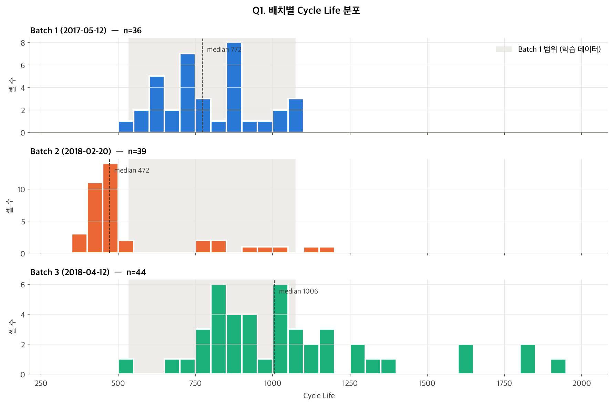
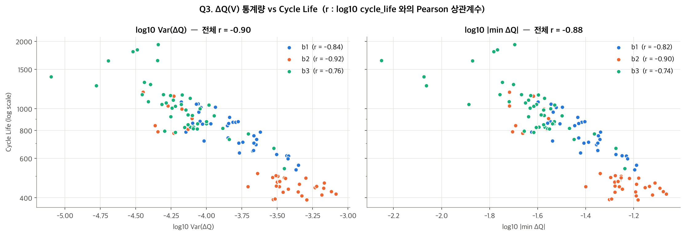
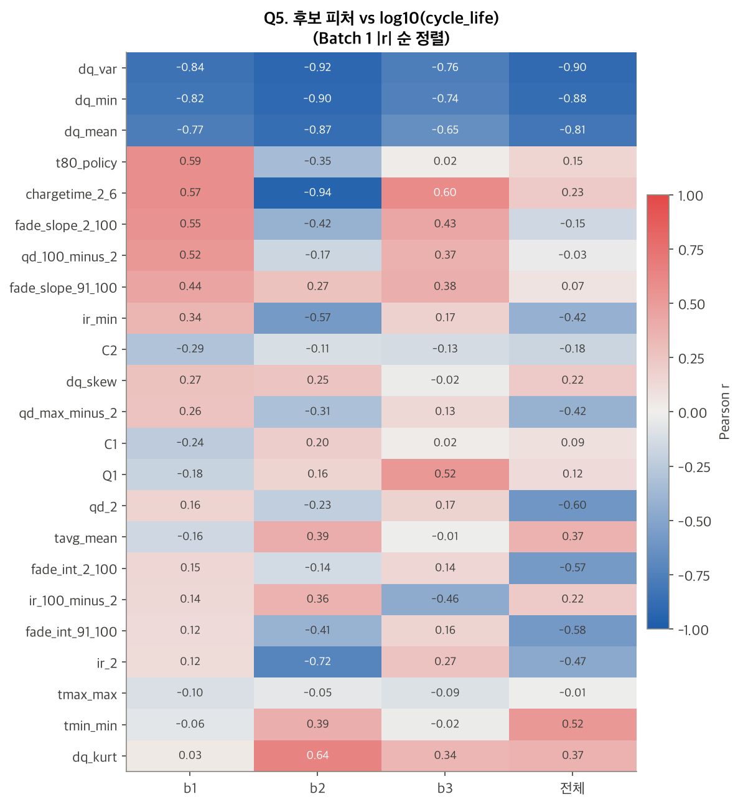

# ESS 배터리 수명 예측

ESS 배터리의 교체 비용은 CAPEX 의 30~40% 를 차지한다. 이 프로젝트는 **초기 100 사이클의 측정 데이터만으로 배터리의 전체 수명을 예측**하여, 교체 시점을 사전에 계획할 수 있는 근거를 만드는 것을 목표로 한다.


## 프로젝트 개요
- 데이터셋 : MIT-Stanford Battery Dataset (Severson et al., Nature Energy 2019)
- EDA 데이터 : Batch 1 + Batch 2 + Batch 3
- 학습 데이터 : Batch 1 (2017-05-12)
- 평가 데이터 : Batch 2 (2018-02-20)
- 태스크 : **Regression** — `cycle_life` (방전 용량이 초기의 80%, 0.88Ah 에 도달할 때까지의 사이클 수) 예측
- 평가 지표 : MAPE (원논문 Target 9.1%)


## 파일 구조
```
├── data/
│   └── README.md               # 데이터 다운로드 및 전처리 방법
├── notebooks/
│   └── 01_EDA.ipynb            # DAY 1 : EDA 및 모델 설계 전략
├── src/
│   ├── preprocess.py           # .mat 원본 → 분석용 캐시 (data/processed/)
│   ├── features.py             # 센서 이상값 정제, ΔQ(V) 및 셀 단위 피처 계산
│   └── viz.py                  # 그래프 공통 스타일
├── results/
│   └── figures/                # EDA 그래프
├── requirements.txt
└── README.md
```


## 환경 설정
```bash
git clone <repository-url>
cd Data_mini_project

python3.12 -m venv .venv
source .venv/bin/activate
pip install -r requirements.txt

# 원본 데이터를 data/ 에 받은 뒤 (data/README.md 참고)
python -m src.preprocess
```


## EDA

`notebooks/01_EDA.ipynb`

### 데이터 정제
- Batch 1 의 10개 셀은 EOL(0.88Ah)에 도달하기 전에 실험이 종료되어 실제 수명을 알 수 없음 → 제외
- Batch 2 의 VarCharge / SLOWCYCLE 실험 셀 8개, Batch 3 의 수명 미도달 셀 2개 → 제외
- 최종 사용 셀 : Batch 1 **36개**, Batch 2 **39개**, Batch 3 **44개**
- 센서 오류값(QD 2.88Ah, 온도 400°C 등)은 정상 범위 밖이면 NaN 처리 후 셀 내부 보간

### Cycle Life 분포
- 배치마다 분포가 크게 다르다. 중앙값 Batch 1 **772** / Batch 2 **472** / Batch 3 **1006**
- Batch 2 는 두 개의 군집 : 일반 셀 30개(392~514)와 `newstructure` 셀 9개(777~1186)
- 핵심 발견 : **Batch 2 의 77% 가 학습 데이터(Batch 1)의 최소 수명 534 보다 짧다** → 학습 범위 밖을 예측해야 하는 외삽 문제



### 열화 곡선 분석
- 모든 배치에서 완만한 감소 → 급격한 감소의 비선형 열화. 초기 100 사이클의 열화 속도는 사실상 0, EOL 직전은 0.9~1.8 mAh/cycle
- Knee point 는 수명의 **70~76%** 지점에서 발생하며, 모든 셀에서 cycle 243 이후
- 핵심 발견 : 예측 시점(cycle 100)에는 모든 셀의 용량이 아직 거의 그대로 → **방전 용량 총량만으로는 장·단수명 구분이 어렵다**

### ΔQ(V) 곡선 분석
- ΔQ₁₀₀₋₁₀(V) = cycle 100 과 cycle 10 의 전압별 방전 용량 차이. 3.0V 부근에서 가장 크게 패인다
- 단수명 셀일수록 곡선이 더 깊고 넓게 패이며, 세 배치 모두 장·단수명 셀의 평균 곡선이 뚜렷하게 구분된다
- 핵심 발견 : **log Var(ΔQ) 와 log(cycle_life) 의 상관 r = −0.84 (B1) / −0.92 (B2) / −0.76 (B3)** — 용량 총량이 변하지 않은 시점에도 ΔQ(V) 는 수명 차이를 담고 있다



### 충전 속도(C-rate)와 수명의 관계
- Batch 1 은 0→80% 충전 시간이 8.9~12.0분으로 다양하고, 느리게 충전할수록 수명이 길다 (r = 0.59)
- Batch 2·3 은 모든 정책이 **10분 충전**으로 동일 → 충전 시간과 수명의 상관이 배치마다 뒤집힌다 (+0.59 / −0.35 / +0.02)
- Batch 2 에서는 같은 정책이라도 `newstructure` 셀의 수명이 약 2배. newstructure 셀은 사이클 안의 휴지 시간이 약 0.3분, 일반 셀은 약 21분
- 핵심 발견 : 충전 정책 변수는 **Batch 1 안에서만 유효한 신호** → Batch 2 로 일반화되지 않는다

### 상관관계
- 초기 100 사이클 기반 후보 피처 23개를 배치별로 비교
- 세 배치에서 부호가 같고 강한 피처는 **ΔQ 계열(`dq_var`, `dq_min`, `dq_mean`)뿐**. 충전 시간, 용량 기울기, IR, 온도는 배치에 따라 부호가 뒤집힌다
- ΔQ 피처끼리 공선성이 매우 높다 (VIF 72~415)




## Modeling

### 피처 엔지니어링 전략
"Batch 1 에서 상관이 높은 피처" 가 아니라 **"배치가 바뀌어도 관계가 유지되는 피처"** 를 기준으로 선택한다.

| 구분 | 피처 | 근거 |
|---|---|---|
| 핵심 | `dq_var` | 세 배치 모두 상관 절댓값 0.76 이상, log-선형 관계 |
| 보조 후보 | `dq_min`, `dq_mean` | 같은 방향으로 강함. 공선성이 높아 규제와 함께 사용 |
| 보조 후보 | `dq_lowv_mean` (파생) | 2.0~2.7V 구간 ΔQ 평균. 세 배치에서 일관되고 `dq_var` 와 겹침이 낮음 |
| 보조 후보 | `fade_slope_91_100`, `qd_2` | 부호 일관 또는 배치 간 차이 보정 가능성 — Valid 성능으로 검증 |
| 제외 | `C1`, `Q1`, `C2`, `t80_policy`, `chargetime_2_6` | Batch 2 에서 값이 거의 상수, 배치마다 부호 반전 |
| 제외 | IR 계열 | 배치마다 부호 반전, Batch 2 에 측정 결측 셀 6개 |
| 제외 | `dq_area_29_31`, `dq_var_50_10`, `dq_v_at_min` (파생) | 배치에 따라 약해지거나 신호 없음. 50 사이클 ΔQ 는 신호 부족 → 예측 시점 100 사이클 유지 |

### 모델 선택 및 근거
- 타깃 : `log10(cycle_life)` — 오른쪽 꼬리가 긴 분포, 상대 오차(MAPE) 평가
- 데이터 분할 : Batch 1 내 **충전 정책 단위** Hold-out / GroupKFold → 같은 정책 셀이 train·valid 에 나뉘는 누수 방지
- 후보 모델 :
  - Linear (`dq_var` 1개) — baseline
  - **ElasticNet / Ridge** — 소표본(36셀) + ΔQ 피처 공선성
  - Random Forest / XGBoost — 비선형성 비교용. 학습 범위 밖 외삽이 불가능해 Batch 2 단수명 셀에서 성능 하락 예상
- 최종 모델 : _(DAY 2)_
- 선택 이유 : _(DAY 2)_


## 성능 결과
_(DAY 2)_


## 오류 분석
_(DAY 2)_


## ESS 도메인 해석
_(DAY 2)_


## 참고문헌
- Severson et al. (2019). Data-driven prediction of battery cycle life before capacity degradation. *Nature Energy*, 4, 383–391.


## 작성자
- 서준영 : EDA, 피처 엔지니어링, 모델 개발, 성능 평가
